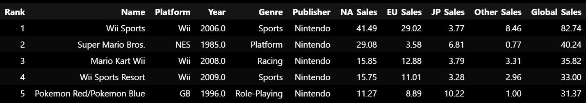

### Video Game sales Dataset 💡 Idea: Improve documentation
Đây là bộ dữ liệu được thu thập để thống kê doanh số của 2 khu vực lớn là NA và EU cùng với Nhật Bản và các quốc gia khác.  
Dữ liệu được thu tập qua từng năm từ những game ra đời từ năm 1980 đến 2020. Các tựa game gồm nhiều thể loại khác nhau được phát hành bởi nhiều nhà sản xuất khác nhau. Từ đó cho thấy một bức tranh phát triển ngành game đầy màu sắc và thú vị.

